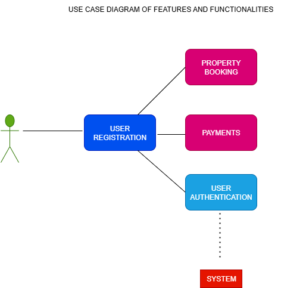

# Requirement Analysis in Software Development 

## Introduction 
This repository is created as part of a structured project to understand and document **Requirement Analysis** in software development. The goal is to providestructured explanations, examples, and best practices to understand how requirements are identified, documented, and managed in *Software Development Lifecycle (SLDC)

The purpose of this repository is to :
- Provide a clear overview of requirement analysis and its importance in software engineering.
- Document different steps, examples, and use cases of requirement gathering.
- Serve as a practical guide for beginners and professionals to learn requirement documentation through real world examples.

## Repository STRUCTURE 
- **/docs** → Contains requirement analysis documents, templates, and detailed explanations.
- **/examples** → contains practical case studies and requirement analysis samples.
- **/diagrams** → Holds use case diagrams, flowcharts, and system design visualisations.
- **README.md** → Overview and purpose of the repository 

---

## What is Requirement Analysis?
**Requirement Analysis** is the process of gathering, understanding, documenting, and validating the needs and expectations of stakeholders for a software system. It is one of the most critical phases of the **Software Development Lifecycle (SDLC)** because it lays the foundation for all other stages of development, such as design, implementation, testing, and maintenance. 

During requirement analysis, software engineers and business analysts work closely with stakeholders (clients, users, project managers, and domain experts) to clearly define:
- **What the system should do** (functional requirements).
- **How the system should perform** (non-functional requirements)
- **Constraints and assumptions** the system must adhere to.

## Why is Requirement Analysis Important?
1. **Prevents misunderstandings** - ensures that developers and stakeholders share a common understanding of project goals. 
2. **Saves cost and time** - identifying errors or ambuiguities early in project avoids expensive rework later.
3. **Provides a foundation for design and development** - accurate requirements make it easier to design and build the right product.
4. **Ensures user satisfisfaction** - aligning the software product with user needs increases the chance of project success. 
5. **Facilitates project planning** - helps estimate effort, budget, and resourses required. 

## Key Activities in Requirement Analysis
Requirement Analysis is not a single step but a collection of importance activities that ensure software requirements are well understood, documented and validated. The major activities include:
### 1. Requirement Gathering : this is the initial stage where information is collected from stakeholders such as customers, users, and domain experts. The goal is to capture *What the stakeholders need* from the system. Techniques ued include interviews, surveys, observations, and reviewing existing documents.

### 2. Requirement Elicitation : Elicitation goes beyond simply gathering information - it focuses on *drawing out* hidden, unclear, or conflicting requirements from stakeholders. Since stakeholders may not always know how to articulate their needs, analysts use tools like brainstorming sessions, use case analysis, pototyping , and workshops to uncover them.

### 3. Requirement Documentation 
Once requirements are identified, they must be written  clearly and systematically. 
- **Software Requirement Specification (SRC):** a detailed written description of functional and non-functional requirements.
- **User stories or use cases:** simplified narratives describing what the user expects.
The main objective is to provide a reference that developers, testers, and stakeholders can all rely on.

### 4. Requirement Analysis and Modelling 
In this activity, requirements are examined for clarity, feasibility, and consistency.
Modelling techniques such as :
- **Use cas diagram**
- **Data flow diagrams** (DFD)
- **Entity-relatioship diagrams (ERD)**
help visualises the requirements and their interactions. This steps ensures the requirements are technically possible and aligned with business goals

### 5. Requirement Validation 
Validation ensures the documented requirements truly reflects stakeholder needs and are achievable. Techniques include:
- **Reviews and walkthroughs** with stakeholders.
- **Prototyping** to confirm expectations.
- **Checklists** to verify completeness and correctness.
The goal is to  ensure no critical requirement is missing, ambiguous, or misunderstood before moving into design and implementation

---

## 4. Types of Requirements 
In software engineering, requirements are generally categorised into **Functional Requirements** and **Non-Functional Requirements**. Both play a critical role in defining the scope, design, and performance of system.

### Functional Requirements 
 functional requirements describe **what the system should do**. They define specific features, services, and busines logic of the application. 

 **Examples for Booking Management Project:**
 - The system must allow users to **register and log in** with a valid email and password.
 - The system should allow users to **search available bookings** by date, location or service type. 
 - The system must allow users to **create a new booking**
 - The system should allow users to **View, Update, or cancel** their bookings.
 - The system should send **email or SMS notifications** after succesful booking confirmation or cancellation 

 #### Non-functional Requirements
 Non-functional requirements describe **how the system performs its functions**. They define the system's quality attributes, performance, and constraints. 

 **Examples for Booking Management project:**
 - The system should handle **1,000 concurrent users** without performance degradation.
 - The system should ensure **data security** by encripting sensitive user information.
 - The system must maintain **99.9% uptime availability** .
 - Response time for searching bookings should not exceed **2 seconds**
 - The system should be **mobile-friendly** and accessible on multiple devices. 

## Use Case Diagrams
**Definition**
A **Use Case Diagram** is a visual representation of the functional requirements of a system. It shows the interactions between **actors** (users or external systems) and the **use cases** (system functions) that they perform.

**Benefits of Use Case Diagrams**
- Provides a high-level overview of the system functionality.
- Helps stakeholders understand system interactions.
- Clarifies roles of users and external systems.
- Serves as a foundation for identifying functional requirements.

**Use Case Diagram for Booking Management System**

The following use diagram illustrates the interactions in the booking management system:

**Actors:**
- **Customer** : Makes and manages bookings.
- **Admin** : Manages bookings and user accounts.
- **Payment System** : Handles payments.

**Use Caes:**
- Register Account
- Login
- Search for Booking
- Make Booking
- Cancel Booking 
- Manage Bookings (Admin)
- Process Payment